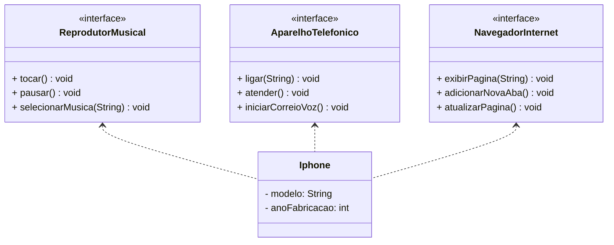

# dio-trilha-java-desafio-iphone
Repositório dedicado à solução do segundo desafio proposto na seção "Programação Orientada a Objetos com Java" do bootcamp "Santander 2024 - Backend com Java". Informações sobre o desafio podem ser vistas [aqui](https://github.com/digitalinnovationone/trilha-java-basico/blob/main/desafios/poo/README.md).

# Diagrama UML da Aplicação

